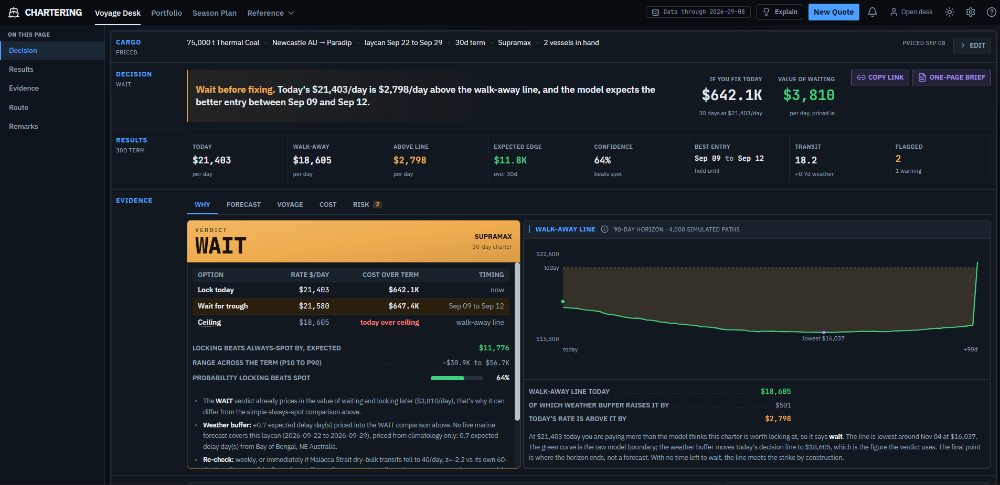
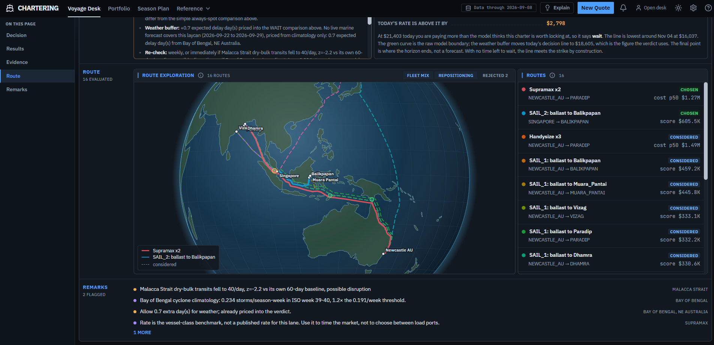

# Chartering Desk: Intelligent Freight Forecasting & Vessel Chartering Optimizer

**Smart India Hackathon 2026 · Internal Round · Team Code Hackerz**

> **Live deployment:** **https://sih-2026-nu-lake.vercel.app**
> (API docs: https://sih2026-backend-s2c6.onrender.com/docs)
>
> The backend runs on a free instance that sleeps after 15 minutes idle. The first
> request after a period of inactivity takes 30 to 60 seconds to wake it. Every
> request after that is fast.

---

## 1. Project Information

- **Project Title:** Chartering Desk, an Intelligent Freight Forecasting & Vessel Chartering Optimizer
- **PS ID:** SIH26006
- **PS Title:** Development of an Intelligent Freight Forecasting Model for Optimized Vessel Chartering and Bulk Cargo Procurement from overseas to East Coast of India
- **Category:** Software
- **Theme:** Transportation & Logistics
- **Team Name:** Code Hackerz
- **Live Deployment:** https://sih-2026-nu-lake.vercel.app

### Team

| Name | Role |
|---|---|
| Ashutosh Naruka | Frontend Engineering |
| Anirudh S Nair | Backend Architecture |
| Aryan Bharadwaj | Backend Engineering |
| Bhumit | Backend Systems |
| Ark Malhotra | ML Lead |
| Muskan Agrahari | Frontend Design |

---

## 2. Problem Statement

SAIL buys ocean freight for imported bulk cargo into East Coast India ports one spot voyage at a
time, decided by ringing the market that morning. That approach has no forward view of rates, no
systematic answer to which ship size to use, no check that the chosen ship can physically enter
Paradip, Visakhapatnam, Gangavaram, Gopalpur, Dhamra, Sagar-Sandheads or Haldia on draft, LOA,
beam and deadweight, and no early warning of the market, congestion and weather events that blow
a voyage up. The result is avoidable freight cost, avoidable idle time, and a chartering strategy
nobody can audit afterwards.

The stated objective is to move from repeated single spot contracts to short and medium term
multiple-voyage contracts, decided proactively.

Full problem statement as issued: [`docs/problem-statement.md`](docs/problem-statement.md).

---

## 3. Proposed Solution

**Chartering Desk** is a decision support system, not a rate chart. A logistics manager describes
one real cargo lot (tonnes, origin, destination, laycan window, contract term) and gets back a
dated **LOCK** or **WAIT** recommendation with the arithmetic shown.

| Layer | What it does |
|---|---|
| **Market** | 14 years of real published dry-bulk indices and time-charter averages feed a gradient-boosted quantile model that forecasts the P10/P50/P90 charter rate per vessel class at 7, 30 and 90 days out. A band, not a point, because everything downstream consumes the uncertainty. |
| **Decision** | The band is blended over the contract term into a **ceiling**: the highest fixed daily rate at which locking still beats spot. That ceiling is then adjusted by the option value of continuing to wait and taxed by expected weather delay, producing a lock/wait price for every day of the horizon. |
| **Physical** | Every vessel class is priced for the actual voyage and checked against real draft, LOA, beam and deadweight limits at both ends, with the binding reason shown for each rejected class. Routes are traced over a real marine network graph, queue time comes from satellite port-call records, and fuel is priced at each departure port's real bunker price. |
| **Risk** | Four independent live signals (rate-regime anomaly, port congestion, chokepoint disruption, and cyclone climatology keyed to the actual laycan weeks), plus an IMO carbon-intensity projection for the voyage. |
| **Accountability** | Every recommendation is written to an append-only ledger as it is made, and a fragility sweep reports how far each input must move before the answer flips. |

### 3.1 What we are doing differently

Most entries to this problem statement reduce to *forecast the rate, draw a chart, pick the
smaller number*. Seven things separate this build from that.

**1. It prices the option to wait, not just the expected price.** Waiting is the right, without
the obligation, to fix later at a better price. That is an American option with a computable
value, priced here by Longstaff-Schwartz least-squares Monte Carlo. On a real worked example the
option was worth **$1,538/day** and moved the walk-away price from $21,016 to $19,478, a reversal
a naive forecast comparison cannot produce.

**2. It models the market that makes the price.** Our **Tonnage Field** reconstructs free
carrying capacity per vessel class, per ocean basin, per future date from free IMF PortWatch
satellite AIS across 128 ports. PortWatch publishes no ship identity, so we infer the size-class
mix from mean parcel size per port call: the number brokers pay commercial vendors for, rebuilt
from public data.

**3. It refuses to invent numbers, and the build enforces it.** A cost that cannot be computed
renders as unavailable, never zero. Every field carries one of five provenance labels, and a
computed value never inherits its input's label. An automated check **fails the build** if
fabricated data appears anywhere in the interface.

**4. It measures decision quality, not forecast accuracy.** The headline metric is realised
saving against always-lock and always-wait baselines, replayed over a frozen split the model
cannot train on. Recommendations go to a ledger that can be cleared entirely but never edited
entry by entry, so anti-cherry-picking is structural rather than a promise.

**5. It answers "how wrong can I be before you're wrong?"** The Fragility screen re-runs the
whole decision, nudging one input at a time, and binary-searches for the flip point. On a real
Newcastle to Paradip lot the permissible draft had **three centimetres** of margin.

**6. The physical world is modelled at the resolution the decision needs.** Chokepoints are
detected per route by real spherical geometry against 28 IMF chokepoint circles, not assumed.
Cyclone risk comes from a per-basin, per-week strike climatology built from NOAA IBTrACS and
keyed to the actual ports and laycan, not a hardcoded "October to December".

**7. Two pieces of genuine cross-domain transfer.** Almgren-Chriss optimal execution, from equity
trading, transplanted so a large seasonal requirement can be split across time without SAIL's own
buying moving the price against itself. Plus a chokepoint fracture index fusing transit
anomalies, GDELT conflict intensity and real war-risk listings. Both are working, tested code,
listed honestly as built but not yet wired into the product surface.

Full technical writeup, every engine and the reasoning behind each method:
[`docs/technical-reference.md`](docs/technical-reference.md).

---

## 4. Key Features

| # | Feature | What it answers |
|---|---|---|
| 1 | **LOCK / WAIT verdict with an exercise boundary** | Should I fix a period charter today, or keep waiting? |
| 2 | **Quantile rate forecast (P10/P50/P90 at 7/30/90 days)** | Where is each vessel class's charter rate heading, and how sure are we? |
| 3 | **Fleet-mix frontier** | Which vessel class, and how many, ranked by real voyage cost, with the binding rejection reason for each infeasible class |
| 4 | **Port constraint checks at both ends** | Will this ship physically fit on draft, LOA, beam, deadweight and handling rate? |
| 5 | **Port Twin (Berth Reality Engine)** | What is this port actually like: real berth register, tide rule, empirical wait and handling percentiles from real port-call records |
| 6 | **Tonnage Field** | How tight is physical ship supply by class and basin, reconstructed from satellite AIS? |
| 7 | **Risk feed** | Rate-regime anomaly, port congestion, chokepoint disruption and cyclone-window alerts, each z-scored against its own series' history |
| 8 | **Voyage scheduling (OR-Tools CP-SAT)** | Which vessel serves which parcel, in what order, under laycan and feasibility constraints? |
| 9 | **Repositioning / backhaul** | Where should the ship go next to avoid deadheading, priced as money rather than a bare probability |
| 10 | **Landed cost with per-component provenance** | What does this cargo cost *delivered*: freight, wait, handling, demurrage, commodity, FX |
| 11 | **Portfolio mix (spot / period TC / COA)** | What contract mix covers a whole season's requirement at a chosen risk appetite? |
| 12 | **Fragility sweep** | How far must each input move before the recommendation flips? |
| 13 | **Decision ledger (live + replay)** | Was the advice any good? Append-only, scored against realised outcomes |
| 14 | **IMO carbon intensity (CII) projection** | What carbon rating would this voyage earn the vessel? |
| 15 | **Satellite anchorage census** | Sentinel-1 SAR CFAR detection of vessels anchored off Paradip |
| 16 | **Route map and chokepoint detection** | What path does this voyage take, and which of 28 chokepoints does it actually cross? |

---

## 5. Technology Stack

| Layer | Technology |
|---|---|
| **Frontend** | React 19, TypeScript, Vite, Tailwind CSS, hand-rolled SVG charts (no charting library) |
| **Backend** | Python 3.12, FastAPI, Pydantic v2 (frozen models), Uvicorn, Server-Sent Events for pipeline progress |
| **Machine Learning** | XGBoost (production quantile models), LightGBM and a PyTorch LSTM (evaluated baselines), scikit-learn |
| **Optimization / OR** | Google OR-Tools CP-SAT (voyage scheduling), Longstaff-Schwartz LSMC (optimal stopping), Particle Swarm Optimization (parameter calibration), Monte Carlo simulation |
| **Data** | Polars (not Pandas), Parquet, searoute (marine network routing), NumPy, SciPy |
| **Geospatial / remote sensing** | Sentinel-1 SAR (CFAR ship detection), rasterio, IMF PortWatch AIS derivatives |
| **Tooling** | `uv` (packaging and runner), Ruff (lint), pytest (109 test files) |
| **Deployment** | Vercel (static frontend + `/api` reverse proxy), Render (FastAPI backend) |

### Data sources, all real and all public

| Source | Feeds |
|---|---|
| Baltic Exchange daily indices (BCI/BPI/BSI/BHSI/BDI) and TC averages, 2005 to 2026 | The forecast target and its lag/rolling/cross features; today's real daily rate |
| IMF PortWatch daily port calls, 161 ports (satellite AIS derived) | Congestion, queue time, tonnage reconstruction, backhaul cargo probability |
| IMF PortWatch chokepoint transits + chokepoint database (28 chokepoints) | Disruption alerts and per-route chokepoint geometry |
| NOAA IBTrACS v04r01 best-track archive (726,241 storm fixes) | Per-basin, per-week cyclone strike climatology |
| Open-Meteo Marine Weather API | 7-day wave-height forecast at both ports (cached, offline-safe) |
| GDELT 2.0 Event Database, 12 months | Chokepoint conflict-intensity signal |
| Port authority / terminal daily traffic reports | Empirical wait and handling distributions (1,211 report rows resolving to 334 real calls) |
| Published berth constraint registers | 58 real berth rows across Visakhapatnam, Dhamra and Gangavaram |
| World Bank Pink Sheet | Commodity benchmark prices and FX for landed cost |
| IMO resolutions MEPC.308(73), 338(76), 352(78), 353(78), 354(78) | Carbon-intensity constants, read from the primary PDFs |
| Copernicus Sentinel-1 GRD scenes | Anchorage vessel census off Paradip |

Every external fetch is a **build-time harvester** that writes into `raw_data/` and caches to
disk. The deployed backend makes no per-request data calls, and degrades to "no signal" rather
than failing a quote when a cache is missing.

---

## 6. Architecture

See [docs/architecture.md](docs/architecture.md) for the full component and data-flow writeup.

```text
                 Logistics manager
                        |
                        |  tonnes . origin . destination . laycan . term . (vessel)
                        v
        +-----------------------------------------------+
        |  React + TypeScript dashboard   (Vercel)      |
        +-----------------------+-----------------------+
                                |  /api  (server-side proxy)
                                v
        +-----------------------------------------------+
        |  FastAPI backend  (Render)  .  21 endpoints   |
        +-----------------------+-----------------------+
                                |
        +-----------------------v-----------------------+
        |  MARKET LAYER                                 |
        |  14 yrs of real indices -> XGBoost quantile   |
        |  forecast . P10/P50/P90 at 7 / 30 / 90 days   |
        +-----------------------+-----------------------+
                                |  rate fan ($/day)
        +-----------------------v-----------------------+
        |  DECISION LAYER                               |
        |  ceiling -> LSMC option value of waiting      |
        |          -> weather tax on the WAIT branch    |
        |          -> LOCK / WAIT + exercise boundary   |
        +------+-----------------------------+----------+
               |                             |
   +-----------v-----------+   +-------------v-----------+
   |  PHYSICAL LAYER       |   |  RISK LAYER             |
   |  fleet-mix frontier   |   |  rate regime anomaly    |
   |  port feasibility     |   |  port congestion        |
   |  CP-SAT scheduling    |   |  chokepoint disruption  |
   |  route + chokepoints  |   |  cyclone climatology    |
   |  landed cost          |   |  CII carbon projection  |
   +-----------+-----------+   +-------------+-----------+
               +--------------+--------------+
                              v
        +-----------------------------------------------+
        |  ACCOUNTABILITY LAYER                         |
        |  append-only decision ledger . fragility      |
        |  sweep . per-field provenance labels          |
        +-----------------------------------------------+
                              |
                              v
                   Dated, explained recommendation
```

Offline supporting pipeline (never runs at request time):

```text
raw_data/  -->  src/data_builders/  -->  src/data/*.parquet  -->  src/ml/  -->  models
(harvesters)      (transforms)        (processed, committed)     (training)
```

---

## 7. Repository Structure

```text
SIH_2026/
├── README.md
├── LICENSE
├── submission/
│   ├── CodeHackerz_SIH2026_Presentation.pptx   # the final 6-page deck
│   ├── CodeHackerz_SIH2026_PDF.pdf             # same deck, PDF
│   ├── PRESENTATION.md          # page-by-page summary
│   └── DEMO.md                  # demo video with voiceover
├── docs/
│   ├── architecture.md          # components and data flow
│   ├── problem-statement.md     # PS SIH26006 as issued
│   ├── technical-reference.md   # every engine, method, and why
│   ├── model-guide.md           # how to add and fairly compare a forecasting model
│   ├── glossary.md              # chartering vocabulary
│   └── deployment.md            # how the live deployment is wired
├── assets/
│   └── screenshots/             # captures from the running system
├── backend/
│   ├── main.py                  # all 21 FastAPI routes
│   └── serialize.py
├── frontend/
│   └── src/                     # React + TypeScript dashboard
│       ├── components/desk/     # the trading-desk panels
│       ├── routes/              # Voyage Desk, Portfolio, Season Plan, Port Twin,
│       │                        #   Tonnage Field, Fragility, Ledger
│       └── lib/                 # API client, formatting
├── src/
│   ├── data/                    # processed parquet/csv + trained models
│   ├── data_builders/           # harvesters and transforms (raw_data to src/data)
│   ├── ml/                      # features, models, live forecast
│   ├── opt/                     # optimizer, quote, stopping, risk, landed cost, portfolio
│   ├── tonnage/                 # ship-supply reconstruction from satellite AIS
│   ├── berth_truth/             # port reality, berth registers, empirical waits
│   ├── fragility/               # flip-point search
│   ├── emissions/               # IMO carbon intensity
│   ├── anchorage/               # Sentinel-1 SAR vessel detection
│   ├── alerts/                  # standing alert evaluation
│   ├── impact/                  # demand elasticity + Almgren-Chriss (experimental)
│   └── auth/                    # accounts and roles
├── raw_data/                    # raw external pulls, never hand-edited
├── scripts/                     # demo, scenario and backtest runners
├── tests/                       # 109 test files
├── pyproject.toml
├── render.yaml                  # backend deployment blueprint
├── run.bat / run.ps1            # one-command local launch (demo)
└── run-dev.bat / run-dev.ps1    # one-command local launch (auto-reload)
```

### What goes where?

| Item | Location |
|---|---|
| Source code | `src/`, `backend/`, `frontend/` |
| Architecture / technical documentation | `docs/` |
| Project screenshots | `assets/screenshots/` |
| Final PPT / presentation | `submission/` |
| Demo video link | `submission/DEMO.md` |
| Project overview | `README.md` |

---

## 8. Final Presentation

The final 6-page SIH presentation is in the [`submission/`](submission/) folder, in both formats:

- **PowerPoint:** [CodeHackerz_SIH2026_Presentation.pptx](submission/CodeHackerz_SIH2026_Presentation.pptx)
- **PDF:** [CodeHackerz_SIH2026_PDF.pdf](submission/CodeHackerz_SIH2026_PDF.pdf)

The PDF opens directly in a browser, so it can be read from GitHub with no download.
See [submission/PRESENTATION.md](submission/PRESENTATION.md) for a page-by-page summary.

---

## 9. Demo Video

A walkthrough of the running system, with voiceover:

**https://youtu.be/LZJ_k0DY9cI**

See [submission/DEMO.md](submission/DEMO.md) for what each part of the video covers.

---

## 10. Screenshots

Both captures are from the running system with real data on disk. Every figure in them is
computed output, not a mockup.

### The decision: verdict, walk-away line and the value of waiting



A real cargo lot priced end to end: 75,000 t of thermal coal, Newcastle AU to Paradip, laycan
22 to 29 September, 30 day term, two vessels in hand. The verdict is **WAIT**, because today's
$21,403/day sits $2,798 above the $18,605 walk-away line. Alongside it: the value of waiting
($3,810/day), the exercise boundary drawn across 4,000 simulated paths, the probability that
locking beats spot (64%), and the reasoning written out in plain sentences, including the
weather buffer that raised the line by $501 and the trigger that should force a re-check.

### The route layer: every option evaluated, and the flagged risks



The same quote's route work. All 16 route and repositioning options the solver actually
considered are drawn on the map and ranked in the list, with the chosen Supramax pairing and the
chosen ballast leg to Balikpapan marked against the alternatives it rejected. Below that, the
flagged remarks: a real Malacca Strait transit drop at z = -2.2 against its own 60 day baseline,
Bay of Bengal cyclone climatology for the actual laycan weeks, and the honest disclosure that the
rate is a vessel-class benchmark rather than a published rate for this specific lane.

---

## 11. Installation

Requires **Python 3.12+** and **Node 18+**.

```bash
git clone https://github.com/Ashutosh-Naruka/SIH_2026.git
cd SIH_2026
```

**Backend**, using `uv`, the project's package manager and runner:

```bash
pip install uv
uv sync
```

Or with a plain virtual environment, if you would rather not install `uv`:

```bash
python -m venv .venv
.venv\Scripts\python.exe -m pip install --upgrade pip     # pip 25.1+ is required for --group
.venv\Scripts\pip install -e .
.venv\Scripts\pip install --group dev
```

**Frontend:**

```bash
cd frontend
npm install
cd ..
```

No API keys, tokens or `.env` file are needed. All processed market data and the trained models
are committed to the repository, so the backend serves real numbers from a clean clone with no
network access.

---

## 12. Run

**One command (Windows):**

```bash
run.bat
```

This starts the backend on `http://127.0.0.1:8000` and the frontend on `http://127.0.0.1:5173`
in separate terminal windows. Use `run-dev.bat` instead while developing (auto-reload on).

**Or run each half by hand:**

```bash
uv run uvicorn backend.main:app --reload           # API on :8000, Swagger UI at /docs
cd frontend && npm run dev                          # UI on :5173, proxies /api to :8000
```

**Tests and lint:**

```bash
uv run python -m pytest -q                          # full suite
uv run ruff check src backend                       # lint
cd frontend && npm run build && npx tsc --noEmit    # frontend build + typecheck
```

**Deployment.** The live build is a two-service deploy: the FastAPI backend on Render (from
[`render.yaml`](render.yaml)) and the static frontend on Vercel, with Vercel proxying `/api/*`
server-side so the session cookie stays same-origin. Full runbook in
[docs/deployment.md](docs/deployment.md).

---

## 13. Future Scope

- **Route-level rate forecasting.** The route-basis mechanism is built and tested, but the only
  route-level rate evidence in the free dataset is three observations of one Indonesia to East
  India assessment, below the evidence bar the system sets for itself and disclosed with a badge
  on every quote. Licensed Baltic route assessments would close this without new modelling.
- **Wire the demand-impact engine into the product.** `src/impact/` (Almgren-Chriss optimal
  charter execution plus a fixed-point solve) is real, tested code held back because its two
  upstream inputs did not clear the identification gate. A validated absolute tonnage scale would
  let it ship.
- **Expose the chokepoint fracture index** as a first-class risk panel.
- **Broaden empirical port coverage.** Rich real wait and handling data exists for Paradip; the
  other ports are honestly gated rather than guessed. More port-authority report parsers close it.
- **Point-in-time data archive.** Two real snapshots exist today. A continuous archive would allow
  fully faithful historical replay of what was knowable on any past date.
- **Live vessel position feed.** Replacing user-entered vessel state with an AIS feed would let
  the scheduler and repositioning engine operate on the real fleet automatically.
- **Rake and plant-level evacuation planning**, extending the optimizer past the discharge berth
  to inland movement and plant burden inventory.

---

## Important

This repository contains no passwords, API keys, access tokens, `.env` files or other
credentials. The account system ships with **no default password and no seeded account**. The
first administrator is created by whoever sets a deployment up, with a password they choose.
